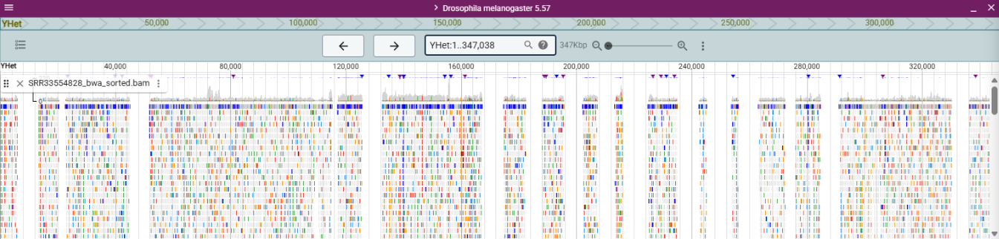
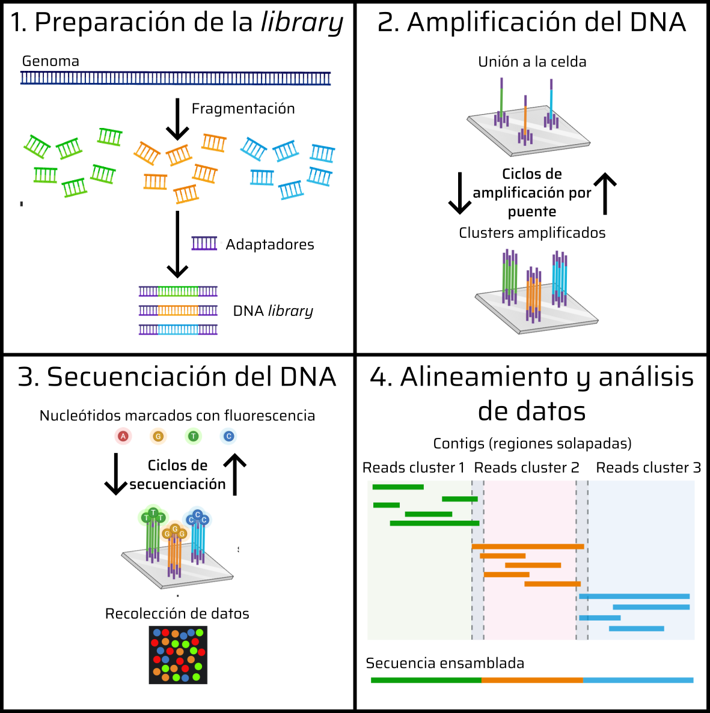

{ width="750", align=center }

# **TP 2**. Del control de calidad a la detección de variantes genómicas { markdown data-toc-label = 'TP 02' }

[:material-download: Materiales](https://drive.google.com/){ .md-button }
[:material-file-powerpoint: Slides](https://drive.google.com/){ .md-button }
[:material-youtube: Clase grabada](https://drive.google.com/){ .md-button }

## Objetivos

* Obtener lecturas de secuenciación de nueva generación (NGS) disponibles en bases de datos públicas
* Interpretar los formatos utilizados comúnmente en NGS
* Realizar controles de calidad de las lecturas e interpretar los resultados
* Mapear secuencias al genoma de referencia
* Visualizar e interpretar alteraciones genéticas

## Introducción

### _Drosophila melanogaster_

_D. melanogaster_ es un organismo modelo ampliamente utilizado en genética y biología del desarrollo. Su ciclo de vida corto, facilidad de cultivo en laboratorio y su genoma relativamente pequeño (aproximadamente 175 millones de pares de bases) lo convierten en un sistema ideal para estudiar procesos biológicos fundamentales.

El genoma de _D. melanogaster_ consiste en cuatro cromosomas principales (X, 2, 3 y 4) y un cromosoma sexual (Y). Fue uno de los primeros genomas de eucariotas en ser secuenciado completamente, habiendo sido publicado en el año 2000. Desde entonces, ha sido objeto de numerosos estudios genómicos que han proporcionado información valiosa sobre la genética, la evolución y la biología del desarrollo.

En este trabajo práctico, vamos a mapear lecturas de secuenciación de _D. melanogaster_ a su genoma de referencia en busca de variantes genéticas. Estas lecturas están disponibles en bases de datos públicas, y forman parte de un estudio titulado **"Drosophila melanogaster strain: Canton S Genome sequencing**. Pueden ver información sobre como se generaron estas lecturas en el diseño del experimento publicado en [**NCBI**](https://www.ncbi.nlm.nih.gov/sra/SRX28785043[accn]). 

**PONER ACÁ ALGO INTERESANTE DE LOS GENES QUE DESPUÉS VAMOS A MIRAR**

### Flujo de trabajo de secuenciación y mapeo 

{ width="750", align=center }

La plataforma de secuenciación que se utilizó para esta secuenciación es DNBSEQ-T7, una plataforma de secuenciación por síntesis que genera lecturas cortas de alta calidad. Un pipeline típico de análisis de datos de secuenciación incluye los siguientes pasos:

**1. Obtención del ADN y preparación de la biblioteca:** Estos pasos son de _wet lab_, y consisten en la extracción del ADN genómico de las muestras biológicas, seguido de la fragmentación del ADN y la adición de adaptadores específicos para la plataforma de secuenciación.

**2. Amplificación:** El ADN fragmentado se amplifica mediante PCR para aumentar la cantidad de material disponible para la secuenciación.

**3. Secuenciación:** La biblioteca amplificada se carga en la plataforma de secuenciación, donde se generan las lecturas de secuenciación. Se obtienen archivos en formato **FASTQ** que contienen las secuencias de las lecturas junto con sus calidades.

**4. Alineamiento y análisis de datos:** Las lecturas generadas se alinean al genoma de referencia utilizando herramientas bioinformáticas. Posteriormente, se realizan análisis para identificar variantes genéticas, evaluar la calidad de las lecturas y otras características relevantes.

## Bases de datos genómicas

Existen numerosas bases de datos que albergan información genómica y genética de _D. melanogaster_. Algunas de las más relevantes son:

* **FlyBase**: Es la base de datos principal para la genética y biología de _D. melanogaster_. Proporciona información sobre genes, mutaciones, fenotipos, secuencias genómicas y mucho más. [FlyBase](https://flybase.org/)

* **Ensembl Metazoa**: Ofrece acceso a datos genómicos de múltiples especies, incluyendo _D. melanogaster_. Permite la visualización y análisis de secuencias genómicas, anotaciones de genes y variantes. [Ensembl Metazoa](https://metazoa.ensembl.org/Drosophila_melanogaster/Info/Index)

* **NCBI**: La base de datos del National Center for Biotechnology Information (NCBI) también alberga secuencias genómicas y datos relacionados con _D. melanogaster_. [NCBI](https://www.ncbi.nlm.nih.gov/)

### Ejercicio 1: Exploración de bases de datos 

Dentro de la carpeta **Materiales** van a encontrar los archivos necesarios para realizar el práctico. El genoma de referencia y sus anotaciones fueron obtenidas de **FlyBase**. Explorando la web de Flybase, respondan:

1. ¿Cuál es la versión del genoma de referencia de _D. melanogaster_ que vamos a utilizar?

2. ¿Qué diferencias hay entre los distintos archivos .fasta? ¿Cuál vamos a utilizar en el TP y por qué?

3. ¿Qué información contiene el archivo .gff3? ¿Para qué lo vamos a utilizar en el TP? ¿Cuántos tipos de .gff3 hay disponibles para esta versión? 

### Ejercicio 2: Inspección de archivos FASTQ

## Métricas de calidad

La calidad de las lecturas de secuenciación es un aspecto crucial en los análisis genómicos. Las métricas de calidad nos permiten evaluar la confiabilidad de las secuencias obtenidas y tomar decisiones informadas sobre su uso en análisis posteriores. Un programa muy usado para evaluar la calidad de las lecturas es **FastQC**. Este software genera un informe detallado que incluye varias métricas clave, tales como:

**ELEGIR UN PAR DE METRICAS Y EXPLICARLAS**

**MENCIONAR MULTIQC**

### Ejercicio 3: Control de calidad de las lecturas

**CODIGO PARA QUE CORRAN MULTIQC**

**PREGUNTAS SOBRE EL INFORME DE MULTIQC**

## Material de lectura y consulta

  * Uno
  * Dos
  * Tres