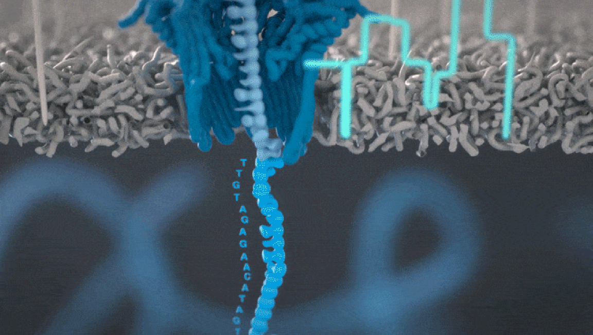

{ width="750", align=center }

# **TP 4**. TP Transcriptómica { markdown data-toc-label = 'TP 03' }

<!--
[:material-download: Materiales](https://drive.google.com/file/d/1b74X8uGOYGTHt_OaJZbn9N385MjwWswV/view?usp=sharing){ .md-button }
[:material-file-powerpoint: Slides](https://docs.google.com/presentation/d/1Vb3GfjxVjIiaMuHPtCnXc1vxpQ3hG7AaOPPnJNm9Ew0/edit?usp=sharing){ .md-button }
[:material-youtube: Clase grabada](https://drive.google.com/){ .md-button }
-->

## Objetivos

* 

## Introducción

